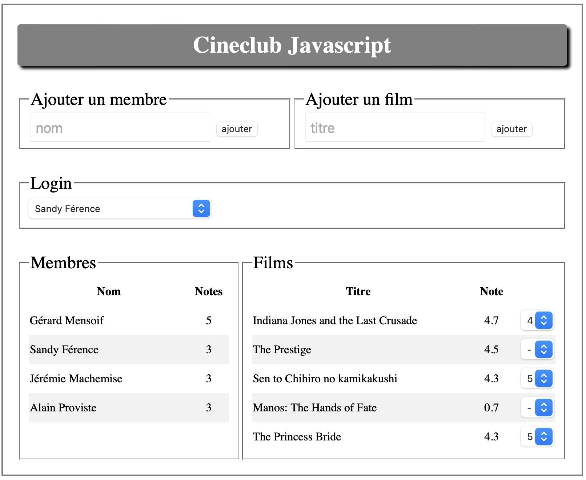
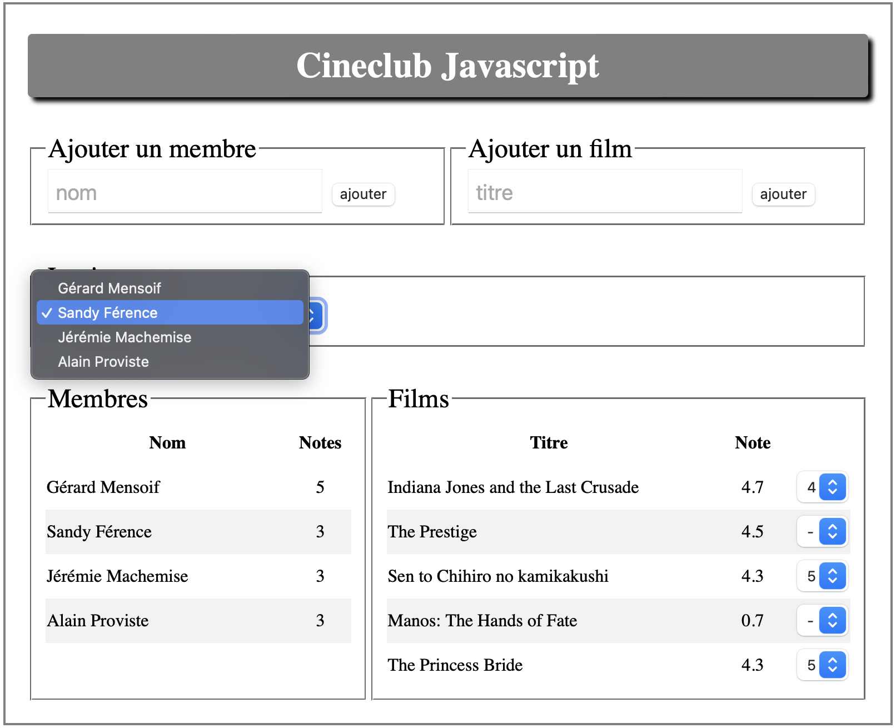
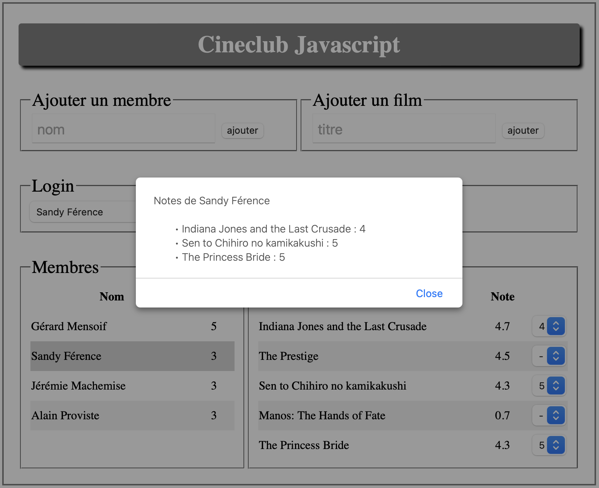
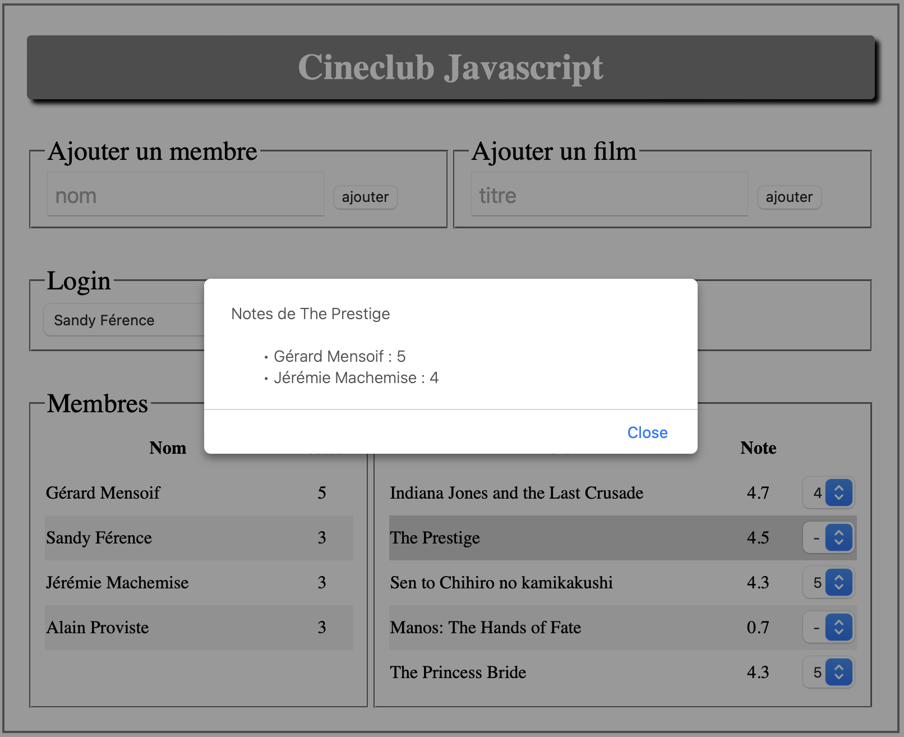

#  Prog. web client riche

**IUT Montpellier-Sète – Département Informatique**

# TD7 - Cinéclub

Cliquez sur le lien ci-dessous pour faire votre fork privé du TD7 :

[https://classroom.github.com/a/7MpqHfhA](https://classroom.github.com/a/7MpqHfhA)

**Attention :** Ce fork devrait être fait dans votre répertoire `public_html` pour être accessible de l'extérieur.


**Date limite de rendu :** Vendredi 25 mars (23:59)

## INTRODUCTION

**Ce TD est évalué et fait office de projet final pour le module.**

Vous pouvez travailler seul ou en binôme. Le rendu se fera à la fois en poussant votre travail sur le dépôt *Github* et en communiquant à votre chargé de TD une adresse accessible de l'extérieur sur laquelle on pourra tester directement dans un navigateur les fonctionnalités implémentées (par exemple le lien vers votre répertoire `public_html`).

Le but de ce TD est de programmer le fonctionnement d’un mini *cinéclub* permettant à des utilisateurs de noter les films qu'ils ont vus.

Le principe est d'utiliser la technologie AJAX pour communiquer avec une base de données dans les deux sens : l'affichage devra refléter les données dans la BDD et les actions de l'utilisateur pourront modifier le contenu de la BDD.

Vous disposez pour ce TD, d’une base pour l'interface web contenue dans les fichiers `index.html` et `css/style.css`. **Vous pouvez modifier ces fichiers selon vos besoins.**

L’interface par défaut du *cinéclub* est la suivante :

<p align="center">
	
</p>
<p align="center">
	capture d’écran 1 – affichage basique
</p>

## Fonctionnalités de base à développer

Cette application travaillera en lien avec une base de données que vous pourrez importer grâce au fichier `td7.sql`. Les entités `membre` et `film` sont matérialisées par des tables. La troisième table `note` associe un `membre` à un `film` et une note (valeur numérique de 0 à 5).

Vous allez développer des fonctionnalités qui permettent d'ajouter ou supprimer des *membres* et des *films*, de modifier les *notes* mises par les utilisateurs aux films et d'afficher l'état courant de la base de données. Plus tard vous pourrez enrichir la base de données si vous souhaiter construire des fonctionnalités plus avancées.

L’utilisateur de votre application devra pouvoir au minimum :

- ajouter un nouveau membre (bloc "Ajouter un membre");
- ajouter un nouveau film (bloc "Ajouter un film");
- voir à tout moment la liste des membres et le nombre de notes que chaque membre a mises (bloc "Membres")
- voir à tout moment la liste des films avec la note moyenne de chaque film (bloc "Films");
- avoir accès, par un clic sur le nom d'un membre, à la liste des notes qu'il a mises ;
- avoir accès, par un clic sur le titre d'un film, à la liste des notes qui ont été mises au film ;

Par ailleurs, le sélecteur dans le bloc "Login" permet de choisir l'utilisateur *actif* (le menu déroulant doit proposer la liste de tous les utilisateurs). Dans le bloc "Films", un menu déroulant à droite de chaque film permet de modifier la note de l'utlisateur *actif* pour le film.

L'état de l'application doit être conservé dans la base de données, et rechargé à chaque nouvelle ouverture de la page.

Chaque action modifiant la base de données devra provoquer une mise à jour automatique de l’interface en temps réel. Voici quelques captures d’écran montrant quelques états possibles de l'interface en fonction des actions.

<p align="center">
	
</p>
<p align="center">
	capture d’écran 2 – choix de l'utilisateur actif
</p>


<p align="center">
	
</p>
<p align="center">
	capture d’écran 3 – clic sur un utilisateur
</p>


<p align="center">
	
</p>
<p align="center">
	capture d’écran 4 – clic sur un film
</p>


## Communication avec la base de données

La plupart des outils pour communiquer avec la base de données vous sont fournis :
- Le fichier `td7.sql` vous permettra de créer les tables, et y placer quelques valeurs d'exemple, que vous pourrez modifier comme vous le souhaitez.
- Le fichier `php/Conf.php` contient la configuration de connexion à la base de données. Vous devez remplir ces informations pour que le script puisse accéder à votre base de données (les commentaires décrivent les informations pour vous connecter à la base de données sur votre compte à l'IUT).
- Le fichier `php/Model.php` contient plusieurs fonctions qui exécutent des requêtes SQL à la base de données (lecture et modification). Vous pouvez vous référer aux commentaires devant chaque fonction.
- Le fichier `get.php` contient un script pour effectuer des requêtes GET à la base de données. Ces requêtes permettent de lire les informations contenues dans la base de données. L'argument `q` de la requête indique le type de données que l'on veut :
  - Si on passe `q=all` le script demande toutes les informations (membres, films et notes) contenues dans la base de données
  - Si on passe `q=notes&membre=12` le script renvoie toutes les notes mises par l'utilisateur d'`id` 12 (sous la forme `{id_film, titre, note}`)
  - Si on passe `q=notes&film=24` le script renvoie toutes les notes mises sur le film d'`id` 14 (sous la forme `{id_membre, nom, note}`)
- Le fichier `set.php` contient un script pour effectuer des requêtes POST à la base de données. Ces requêtes permettent de modifier les informations contenues dans la BDD. L'argument `action` de la requête indique l'action à exécuter :
  - `action=delete` permet de supprimer un membre ou un film (en passant un `id`), par exemple `action=delete&membre=12` ou `action=delete&film=24`
  - `action=add` ajoute un membre ou un film en passant le nom ou le titre (l'`id` est auto-incrémenté), par exemple `action=add&nom=Jean%20Bon` ou `action=add&titre=The%20Matrix`
  - `action=update` permet de créer/modifier/supprimer une note en fournissant les `id` du membre et du film et la note, par exemple `action=update&membre=12&film=24&note=3`. Si une note pour ce film par cet utilisateur existe déjà, elle est modifiée. Une note à -1 efface la note existante.

Il est possible de faire tout le TD en utilisant ces scripts, mais si vous le souhaitez **vous pouvez les modifier comme ça vous arrange** (et éventuellement ajouter d'autres scripts).


## Conseils et Consignes

- Maintenez une organisation claire des fichiers et du code
  - Placez les fichiers dans les répertoires adaptés
  - Nommez vos fonctions, méthodes et variables de manière à ce que leur signification soit claire
  - Commentez les fonctions dont l'action n'est pas immédiatement compréhensibles
  - Regroupez votre code dans des classes lorsque c'est pertinent
- Il existe de nombreuses façons d'implémenter les différentes fonctionnalités. Réfléchissez éventuellement un peu aux différentes alternatives avant de vous lancer dans la programmation, et éventuellement envisagez de refactoriser votre travail si vous pensez que les choix que vous avez fait initialement ne sont pas pertinents.

**Important :** Vous pouvez discuter avec les autres mais chacun (ou chaque binôme) doit écrire son code, ne copiez pas des morceaux de code d'un projet à l'autre sous peine d'être fortement pénalisés !


## Autres fonctionnalités

En plus du minimum qui est demandé, vous pouvez ajouter des fonctionnalités supplémentaires à votre application. Quelques suggestions :

### Suppression

Vous pouvez ajouter des boutons pour supprimer les membres et les films qui ont été enregistrés.

### Autocomplétion

Vous pouvez ajouter un mécanisme d'autocomplétion comme celui qui a été vu au TP6 lorsqu'on entre le titre d'un film à ajouter. Pour cela, vous pouvez utiliser des requêtes GET au script `https://webinfo.iutmontp.univ-montp2.fr/~vpetud/movies.php` en lui passant un paramètre `s` (une chaîne de caractères). Le script renvoie alors une liste de titres de films commençant par `s`.

Par exemple `movies.php?s=Rebe` renvoie le tableau
```json
[{"title":"Rebecca"},{"title":"Rebel Without a Cause"},{"title":"Rebecca"},{"title":"Rebel in the Rye"}]
```
